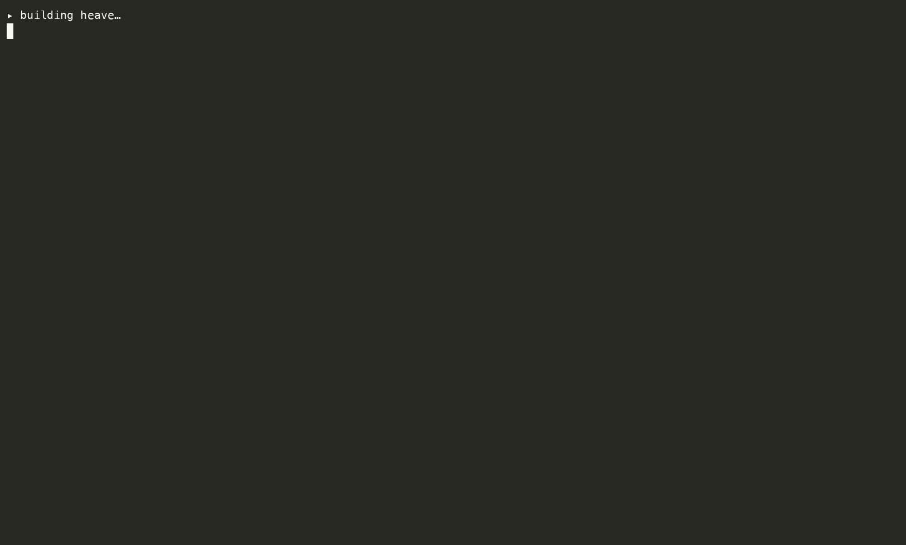

# heave

[](https://github.com/somasays/heave/actions/workflows/ci.yml)
[](LICENSE)
[](go.mod)

**A runtime spend & quota firewall for AI agents.** Self-hostable,
OpenAI-compatible, single Go binary. It sits in front of your models and stops a
runaway agent **before** the vendor is billed — hard, real-time, per-run.

Monthly budgets don't stop an agent burning five figures overnight, and "fail
over after a 429" doesn't arbitrate a provider quota shared across ten teams.
heave is the enforcement point that does.

---

## The one demo

A runaway agent hammering the same request on one run. The firewall kills the run
after the threshold — every later call is refused **before it reaches the vendor**:



```
$ ./demo/runaway.sh          # firewall ON: loop_threshold=3, max_usd_per_run=$0.01

  a runaway agent starts looping the same request on run 'agent-run-7':
  call 1 → 200 OK         (reached the vendor, billed)
  call 2 → 200 OK         (reached the vendor, billed)
  call 3 → 403 RUN KILLED (refused PRE-vendor — $0)
  call 4 → 403 RUN KILLED (refused PRE-vendor — $0)
  ...
  call 8 → 403 RUN KILLED (refused PRE-vendor — $0)

  /v1/stats: billed 2 vendor calls, $0.00008 — then the firewall stopped it
```

| a runaway agent, 8 calls | firewall **OFF** | firewall **ON** |
| --- | --- | --- |
| calls that reach the vendor | 8 | **2** |
| billed | all of it | **capped, then $0** |
| outcome | unbounded | killed, 6 refused pre-vendor |

The loss is bounded by *your control*, not by how long the runaway ran.

## Quickstart

```bash
# 1. run it (in-memory, no external state needed)
export ANTHROPIC_API_KEY=sk-ant-...
make run                       # or: docker compose up

# 2. or watch the firewall kill a runaway
./demo/runaway.sh
```

Point any OpenAI SDK at `http://localhost:8080/v1` and send
`X-Heave-Run-Id: <your-agent-run-id>` so per-run controls apply.

## What it enforces (Invariant #9)

All controls are **pre-vendor** and generalize one idea — *reserve/settle* — from
a slow monthly budget down to short time constants and run scope:

- **Velocity caps** — `$/min` and `tokens/min`, per client *and* per run, reserved
  at admit so concurrent requests can't overshoot.
- **Per-run kill switch** — `POST /v1/runs/{id}/kill`, plus auto-trip on loop
  detection.
- **Hard per-run `$` budget** — the backstop for changing-prompt runaways loop
  detection can't see.
- **Concurrency caps** and **repeated-prompt (loop) detection**.
- **Provider-quota brokering** — reserve a vendor's known RPM/TPM *before*
  dispatch and route to a provider with headroom, instead of provoking its 429.

With `firewall.redis_url` set, velocity/concurrency/kills hold **across a replica
fleet** (one atomic Redis reserve/settle), not N× per instance. Every request is
**attributed** by client and run — in memory, on a built-in `/dashboard`, and in a
durable Postgres ledger (`/v1/spend`).

## What it is — and isn't

- **It is:** hard, real-time, pre-vendor enforcement on a fast Go data-plane —
  the thing a proxy-with-budgets that sits *beside* your spend structurally can't
  do.
- **It is *not* a "halve your bill" tool.** We spiked cache-aware routing as the
  original wedge, [measured it honestly](docs/BENCHMARK.md) (~10–13%), and
  **demoted it** ([ADR&nbsp;0001](docs/adr/0001-pivot-to-agent-spend-firewall.md)).
  heave bounds the *blast radius* of agentic overspend; it doesn't reduce your
  steady-state bill.

The end-to-end validation ships the negative results too: loop detection is blind
to a growing-context runaway — so the per-run `$` budget catches exactly that
(`internal/server/e2e_firewall_test.go`, plus a live-API tier).

## How it's built

- Go 1.26, standard-library HTTP. Redis (shared state) and Postgres (durable
  ledger) are optional, behind the compose `state` profile — the binary runs
  without them.
- **Architecture enforced in CI, not review** — layered imports (`depguard`), a
  vendor/secret boundary check, `-race`, and a commit hook. See
  [`docs/INVARIANTS.md`](docs/INVARIANTS.md).
- **Every phase carries two adversarial reviews** (an LLM-apps/security expert and
  a Go expert) before it's "done" — recorded in [`docs/reviews/`](docs/reviews/).
- Design decisions are ADRs ([`docs/adr/`](docs/adr/)).

This repo is the production validation of the essay
[**Engineering for AI Agents**](https://theprincipledengineer.substack.com/p/engineering-for-ai-agents).

## Status

The firewall wedge is fully built, cross-replica, and validated against the real
Anthropic API and a real Postgres. See [`docs/TASKS.md`](docs/TASKS.md) for the
roadmap and [`docs/COMPARISON.md`](docs/COMPARISON.md) for how it differs from
LiteLLM / Portkey / Cloudflare AI Gateway.

## License

Apache-2.0.
